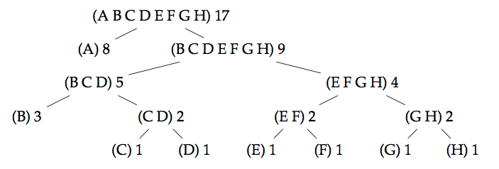

### Functional Programming Course in Scala

The objective is to code a Huffman algorithm, which is a compression algorithm that can be used to compress lists of characters.

In a normal, uncompressed text, each character is represented by the same number of bits (usually eight). In Huffman coding, each character can have a bit representation of a different length, depending on how common a character is: the characters that appear often in a text are represented by a shorter bit sequence than those being used more rarely. Every huffman code defines the specific bit sequences used to represent each character.

